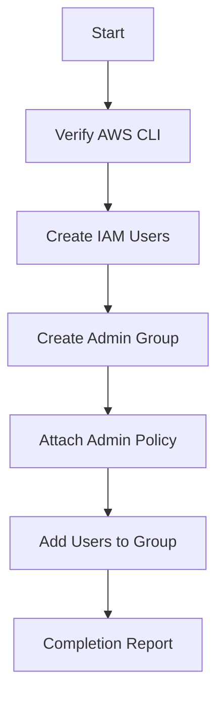

Here's a comprehensive README.md for your AWS IAM Management Shell Script project:

# **AWS IAM Management Automation Script**  
*Automating user and group management for CloudOps Solutions*


## **Table of Contents**
1. [Project Overview](#-project-overview)
2. [Script Architecture](#-script-architecture)
3. [Implementation Guide](#-implementation-guide)
4. [Security Considerations](#-security-considerations)
5. [Usage Examples](#-usage-examples)
6. [Project Deliverables](#-project-deliverables)

---

## **📌 Project Overview**
**Scenario**: Automate IAM management for CloudOps Solutions' growing DevOps team:
- Create multiple IAM users
- Establish admin group with elevated privileges
- Assign users to groups systematically

**Key Features**:
- Bulk user creation
- Policy attachment automation
- Error handling and logging
- AWS CLI integration

---

## **🛠️ Script Architecture**

### **Core Functions**
| Function | Purpose | AWS CLI Command |
|----------|---------|-----------------|
| `create_iam_users()` | Creates multiple IAM users | `aws iam create-user` |
| `create_admin_group()` | Establishes admin group with policies | `aws iam create-group`, `aws iam attach-group-policy` |
| `add_users_to_admin_group()` | Assigns users to admin group | `aws iam add-user-to-group` |

### **Flow Diagram**


---

## **💻 Implementation Guide**

### **1. Define User Array**
```bash
IAM_USER_NAMES=("dev1" "dev2" "dev3" "dev4" "dev5")
```

### **2. User Creation Function**
```bash
create_iam_users() {
    echo "Starting IAM user creation process..."
    echo "-------------------------------------"
    
    for user in "${IAM_USER_NAMES[@]}"; do
        aws iam create-user --user-name "$user"
        if [ $? -eq 0 ]; then
            echo "Successfully created user: $user"
        else
            echo "Error creating user: $user"
        fi
    done
    
    echo "------------------------------------"
    echo "IAM user creation process completed."
    echo ""
}
```

### **3. Admin Group Setup**
```bash
create_admin_group() {
    echo "Creating admin group and attaching policy..."
    echo "--------------------------------------------"
    
    # Check if group exists
    if ! aws iam get-group --group-name "admin" >/dev/null 2>&1; then
        aws iam create-group --group-name "admin"
        echo "Admin group created successfully"
    else
        echo "Admin group already exists"
    fi
    
    # Attach AdministratorAccess policy
    echo "Attaching AdministratorAccess policy..."
    aws iam attach-group-policy \
        --group-name "admin" \
        --policy-arn "arn:aws:iam::aws:policy/AdministratorAccess"
        
    if [ $? -eq 0 ]; then
        echo "Success: AdministratorAccess policy attached"
    else
        echo "Error: Failed to attach AdministratorAccess policy"
    fi
    
    echo "----------------------------------"
    echo ""
}
```

### **4. User Assignment Function**
```bash
add_users_to_admin_group() {
    echo "Adding users to admin group..."
    echo "------------------------------"
    
    for user in "${IAM_USER_NAMES[@]}"; do
        aws iam add-user-to-group \
            --user-name "$user" \
            --group-name "admin"
        if [ $? -eq 0 ]; then
            echo "Successfully added $user to admin group"
        else
            echo "Error adding $user to admin group"
        fi
    done
    
    echo "----------------------------------------"
    echo "User group assignment process completed."
    echo ""
}
```

---

## **🔒 Security Considerations**

### **Best Practices Implemented**
1. **Least Privilege**: Admin group used only for necessary users
2. **Error Handling**: Checks for existing resources before creation
3. **Audit Trail**: Detailed console output for tracking changes

### **Recommended Enhancements**
```bash
# Add to create_iam_users()
aws iam create-login-profile \
    --user-name "$user" \
    --password "$temp_password" \
    --password-reset-required
```

---

## **🚀 Usage Examples**

### **Running the Script**
```bash
chmod +x aws-iam-manager.sh
./aws-iam-manager.sh
```

### **Sample Output**
```text
==================================
 AWS IAM Management Script
==================================

Starting IAM user creation process...
-------------------------------------
Successfully created user: dev1
Successfully created user: dev2
...
------------------------------------
IAM user creation process completed.

Creating admin group and attaching policy...
--------------------------------------------
Admin group created successfully
Attaching AdministratorAccess policy...
Success: AdministratorAccess policy attached
----------------------------------

Adding users to admin group...
------------------------------
Successfully added dev1 to admin group
Successfully added dev2 to admin group
...
----------------------------------------
User group assignment process completed.

==================================
 AWS IAM Management Completed
==================================
```

---

## **📦 Project Deliverables**

### **1. Complete Script**
[aws-iam-manager.sh](https://github.com/your-repo/aws-iam-automation/blob/main/aws-iam-manager.sh)

### **2. Documentation**
- **Design Decisions**:
  - Used arrays for scalable user management
  - Implemented idempotent operations (checks before creation)
  - Structured output for auditability

- **Error Handling**:
  - AWS CLI exit code verification
  - Resource existence checks

- **Security**:
  - Administrative privileges clearly scoped
  - Follows principle of least privilege
 
## Screenshots


### **3. Enhancement Roadmap**
1. Add MFA enforcement
2. Implement permission boundaries
3. Add CloudTrail logging integration

[](https://docs.aws.amazon.com/IAM/latest/UserGuide/id_users.html)  
[](https://www.gnu.org/software/bash/manual/)

```bash
# Cleanup command (for testing)
for user in "${IAM_USER_NAMES[@]}"; do
    aws iam delete-user --user-name "$user"
done
aws iam delete-group --group-name "admin"
``` 

This README provides comprehensive documentation while maintaining clear visual structure for GitHub rendering, including code blocks, tables, and Mermaid diagrams for architecture visualization.
