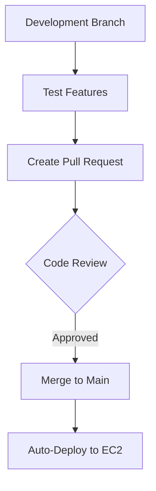

# **MarketPeak E-Commerce Platform Deployment**


## **Table of Contents**
1. [Project Overview](#-project-overview)
2. [Technical Stack](#-technical-stack)
3. [Deployment Steps](#-deployment-steps)
4. [CI/CD Workflow](#-cicd-workflow)
5. [Troubleshooting](#-troubleshooting)
6. [Repository Structure](#-repository-structure)

---

## **📝 Project Overview**
This project deploys a full-stack e-commerce platform ("MarketPeak") using:
- **Git** for version control
- **Linux** (Amazon Linux 2) as the server environment
- **AWS EC2** for cloud hosting
- **Apache HTTPD** as the web server

Key features include product listings, shopping cart functionality, and user authentication via a template-based frontend.

---

## **🛠️ Technical Stack**
| Component | Technology |
|-----------|------------|
| Version Control | Git/GitHub |
| Server OS | Amazon Linux 2 |
| Web Server | Apache HTTPD 2.4 |
| Hosting | AWS EC2 (t2.micro) |
| Frontend | HTML5/CSS3/JS Template |

---

## **🚀 Deployment Steps**

### **1. Local Development Setup**
```bash
# Initialize project
mkdir MarketPeak_Ecommerce
cd MarketPeak_Ecommerce
git init

# Add template files (from Tooplate)
wget https://www.tooplate.com/zip-templates/2108_dashboard.zip
unzip 2108_dashboard.zip -d template
mv template/* .

# Configure Git
git config --global user.name "MarketPeakDev"
git config --global user.email "dev@marketpeak.example"
git add .
git commit -m "Initial commit with e-commerce template"
```

### **2. AWS EC2 Configuration**
```bash
# Connect to instance
ssh -i "marketpeak-key.pem" ec2-user@<PUBLIC_IP>

# Install Apache
sudo yum update -y
sudo yum install httpd git -y
sudo systemctl start httpd
sudo systemctl enable httpd
```

### **3. Deployment to Production**
```bash
# Clone repository (HTTPS)
sudo git clone https://github.com/yourusername/MarketPeak_Ecommerce.git /var/www/html/

# Set permissions
sudo chown -R apache:apache /var/www/html
sudo chmod -R 755 /var/www/html

# Restart Apache
sudo systemctl restart httpd
```

---

## **🔄 CI/CD Workflow**


### **Key Steps:**
1. **Feature Development**
   ```bash
   git checkout -b feature/new-checkout
   # Make changes...
   git push origin feature/new-checkout
   ```

2. **Production Deployment**
   ```bash
   ssh ec2-user@<IP> "cd /var/www/html && sudo git pull"
   sudo systemctl reload httpd
   ```

---

## **🐛 Troubleshooting**
| Issue | Solution |
|-------|----------|
| 403 Forbidden | Check Apache permissions: `sudo chown -R apache:apache /var/www/html` |
| Git Push Rejected | Pull latest changes first: `git pull --rebase` |
| Apache Not Running | Verify service: `sudo systemctl status httpd` |
| SSH Connection Refused | Check security group inbound rules for port 22 |

---

## **📂 Repository Structure**
```
MarketPeak_Ecommerce/
├── assets/          # Static files
│   ├── css/
│   ├── js/
│   └── images/
├── products/        # Product pages
├── cart.html        # Shopping cart
├── index.html       # Homepage
└── README.md        # Deployment docs
```

---

## **🔗 Important Links**
- [EC2 Instance Dashboard](https://console.aws.amazon.com/ec2)
- [Apache Documentation](https://httpd.apache.org/docs/)
- [GitHub Repository](https://github.com/yourusername/MarketPeak_Ecommerce)

```bash
# Quick Deploy Command
ssh -i "key.pem" ec2-user@<IP> "sudo git -C /var/www/html pull && sudo systemctl restart httpd"
```

**Pro Tip**: Set up GitHub Actions to auto-deploy on push to main branch!

```yaml
# .github/workflows/deploy.yml
name: Deploy to EC2
on: [push]
jobs:
  deploy:
    runs-on: ubuntu-latest
    steps:
      - uses: actions/checkout@v2
      - run: ssh ec2-user@${{ secrets.EC2_IP }} "cd /var/www/html && sudo git pull"
```
