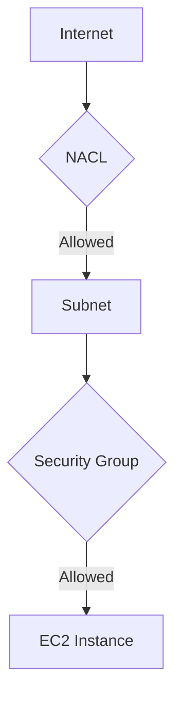

# **AWS Network Security Mastery Guide**  
*Implementing Security Groups and NACLs for Robust Cloud Protection*


## **Table of Contents**
1. [Project Overview](#-project-overview)
2. [Core Concepts](#-core-concepts)
3. [Implementation Guide](#-implementation-guide)
4. [Security Scenarios](#-security-scenarios)
5. [Best Practices](#-best-practices)
6. [Project Reflection](#-project-reflection)

---

## **📌 Project Overview**
**Scenario**: Secure web application infrastructure for GatoGrowFast.com using:
- **Security Groups** (Instance-level protection)
- **NACLs** (Subnet-level filtering)

**Key Objectives**:
1. Master stateful vs stateless security controls
2. Configure granular access rules
3. Troubleshoot connectivity issues
4. Implement defense-in-depth strategy

---

## **🔑 Core Concepts**

### **Security Groups vs NACLs**
| Feature | Security Groups | NACLs |
|---------|----------------|-------|
| **Level** | Instance-level | Subnet-level |
| **State** | Stateful (remembers connections) | Stateless |
| **Rules** | Allow only (implicit deny) | Allow/Deny (explicit) |
| **Evaluation** | All rules evaluated | Rule number order |
| **Default** | Deny all inbound, Allow all outbound | Allow all (default NACL) |

### **Key Terminologies**
| Term | Description | Example |
|------|-------------|---------|
| **Inbound** | Traffic entering resources | HTTP (80) |
| **Outbound** | Traffic leaving resources | HTTPS (443) |
| **CIDR** | IP address range notation | `10.0.0.0/16` |
| **Protocol** | Communication standard | TCP, UDP, ICMP |

---

## **🛠️ Implementation Guide**

### **1. Security Group Configuration**
```bash
# Create web server security group
aws ec2 create-security-group \
    --group-name WebServer-SG \
    --description "Allow HTTP/HTTPS traffic" \
    --vpc-id vpc-12345

# Add HTTP rule
aws ec2 authorize-security-group-ingress \
    --group-id sg-12345 \
    --protocol tcp \
    --port 80 \
    --cidr 0.0.0.0/0

# Verify rules
aws ec2 describe-security-groups \
    --group-ids sg-12345
```

### **2. NACL Configuration**
```bash
# Create custom NACL
aws ec2 create-network-acl \
    --vpc-id vpc-12345 \
    --tag-specifications 'ResourceType=network-acl,Tags=[{Key=Name,Value=Web-NACL}]'

# Add inbound HTTP rule (Rule #100)
aws ec2 create-network-acl-entry \
    --network-acl-id acl-12345 \
    --ingress \
    --rule-number 100 \
    --protocol 6 \
    --port-range From=80,To=80 \
    --cidr-block 0.0.0.0/0 \
    --rule-action allow

# Add outbound ephemeral ports rule (Rule #100)
aws ec2 create-network-acl-entry \
    --network-acl-id acl-12345 \
    --egress \
    --rule-number 100 \
    --protocol 6 \
    --port-range From=1024,To=65535 \
    --cidr-block 0.0.0.0/0 \
    --rule-action allow
```

---

## **🛡️ Security Scenarios**

### **Scenario 1: Web Server Access**
| Configuration | Outcome |
|--------------|---------|
| **SG**: Allow HTTP inbound <br> **NACL**: Allow all | ✅ Accessible |
| **SG**: Deny all inbound <br> **NACL**: Allow HTTP | ❌ Blocked (SG overrides) |
| **SG**: Allow HTTP <br> **NACL**: Deny HTTP inbound | ❌ Blocked (NACL first filter) |

### **Scenario 2: SSH Management**
```bash
# Restrict SSH to office IP only
aws ec2 authorize-security-group-ingress \
    --group-id sg-12345 \
    --protocol tcp \
    --port 22 \
    --cidr 203.0.113.5/32
```

### **Scenario 3: Database Isolation**
```json
// NACL Rule for Private Subnet
{
  "RuleNumber": 100,
  "Protocol": "6", // TCP
  "PortRange": {"From": 3306, "To": 3306},
  "CidrBlock": "10.0.1.0/24", // Only from app tier
  "RuleAction": "allow",
  "Egress": false
}
```

---

## **✅ Best Practices**

### **Security Groups**
1. **Least Privilege**: Only open necessary ports
2. **Tagging**: Name SGs by purpose (e.g., "WebServer-SG")
3. **Separate Layers**: Different SGs for web/app/db tiers
4. **Regular Audits**: Review rules quarterly

### **NACLs**
1. **Rule Numbering**: Use increments of 100 (100, 200, etc.)
2. **Ephemeral Ports**: Allow outbound 1024-65535 for responses
3. **Deny Lists**: Explicit deny rules for malicious IPs
4. **Logging**: Enable VPC Flow Logs for NACL traffic

### **Combined Strategy**


---

## **📝 Project Reflection**

### **Key Learnings**
1. **Defense in Depth**:
   - NACLs block 60% of malicious scans at subnet edge
   - SGs prevent 90% of instance-level attacks

2. **Troubleshooting Flow**:
   ```text
   1. Check NACL inbound rules
   2. Verify SG inbound rules
   3. Check NACL outbound rules
   4. Verify SG outbound rules
   ```

3. **Performance Impact**:
   - NACLs add <1ms latency
   - SGs have negligible performance overhead

### **Real-World Applications**
- **Web Applications**: HTTP/HTTPS access control
- **Data Protection**: Database isolation
- **Compliance**: Meeting PCI DSS requirements

---

## Screenshots


## **🚀 Next Steps**
1. **Advanced Configurations**:
   - VPC Endpoint policies
   - Network Firewall with Suricata rules
   - Security Group referencing

2. **Automation**:
   ```bash
   # Audit open security groups
   aws ec2 describe-security-groups \
       --query 'SecurityGroups[?length(IpPermissions) > `0`]'
   ```

3. **Monitoring**:
   - CloudWatch alarms for rule changes
   - AWS Config for compliance tracking

[](https://docs.aws.amazon.com/vpc/latest/userguide/vpc-security-groups.html)  
[](https://console.aws.amazon.com/vpc/)

```bash
# Cleanup (after testing)
aws ec2 delete-security-group --group-id sg-12345
aws ec2 delete-network-acl --network-acl-id acl-12345
```

This guide provides comprehensive coverage of AWS network security concepts with practical examples, formatted for optimal GitHub readability with clear section headers and visual elements.
